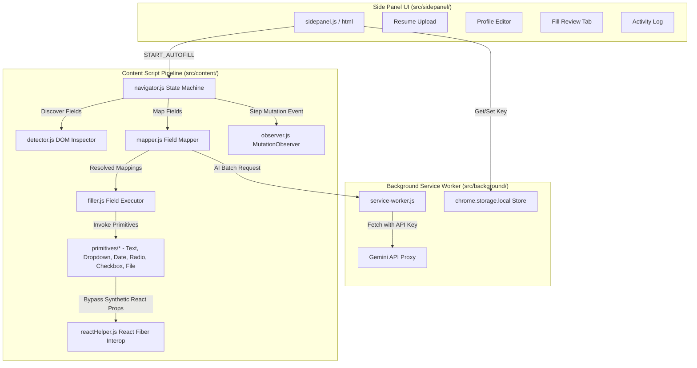
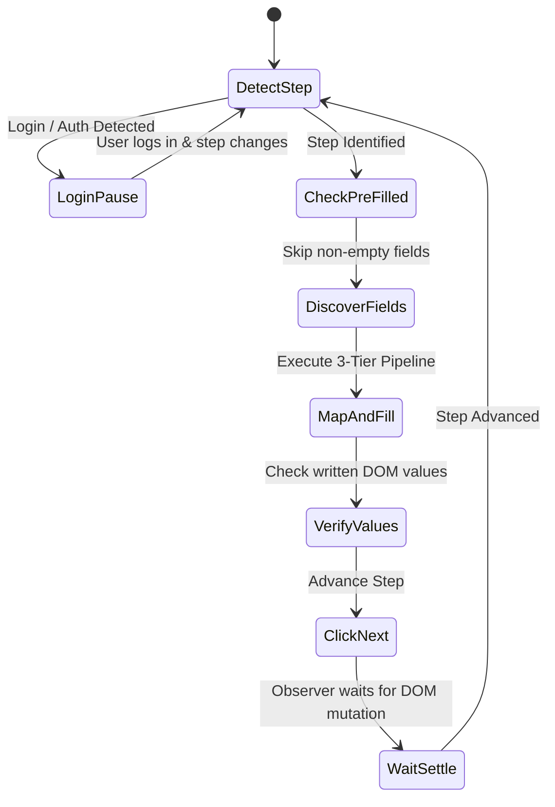

# Workday AutoFill AI — Architecture Overview

This document describes the architectural layout, modular separation, resolution pipeline, UI primitives, and state machine powering the **Workday AutoFill AI Chrome Extension**.

---

## 1. System Architecture & Module Diagram

The extension strictly enforces a separation between user interface management, background API operations, and DOM manipulation scripts.



### Architectural Roles:
* **Background Service Worker (`src/background/service-worker.js`)**: Serves as the central security and API gateway. **All AI network requests pass exclusively through the service worker.** Content scripts never make external network calls directly, isolating the API key within `chrome.storage.local`.
* **Side Panel (`src/sidepanel/`)**: Provides the user interface for resume parsing, JSON profile editing, progress tracking, live activity logs, and final manual submission confirmation.
* **Content Scripts (`src/content/`)**: 
  * `navigator.js`: Drives the multi-step form state machine and step progression.
  * `detector.js`: Inspects DOM elements, extracts labels, identifies widget types, and checks existing field values.
  * `mapper.js`: Executes the three-tier mapping strategy.
  * `filler.js`: Coordinates execution across widget-specific primitive modules.

---

## 2. Three-Tier Field Resolution Engine

To minimize API latency and token consumption while maximizing fill precision, `mapper.js` resolves form fields using a progressive three-tier cascade:

```mermaid
flowchart LR
    Field[Discovered Form Field] --> Tier1{1. Deterministic Map}
    Tier1 -->|Match automationId| Res1[Confidence: 1.0 | Cost: $0]
    Tier1 -->|No match| Tier2{2. Heuristic Map}
    Tier2 -->|Synonym Match| Res2[Confidence: 0.8 | Cost: $0]
    Tier2 -->|No match| Tier3[3. Batched AI Map]
    Res3[Confidence: Dynamic | Cost: ~1 API call / step] <-- Tier3
```

1. **Tier 1: Deterministic Resolution (Confidence: 1.0 | $0 API Cost)**
   * Matches `data-automation-id` against `AUTOMATION_ID_MAP` in [constants.js](file:///D:/Hidani-Tech/src/lib/constants.js#L1).
   * Directly links standard Workday fields (e.g., `formField-legalName--firstName` $\rightarrow$ `name.first`).
   * Handles ~60–80% of standard Workday application fields instantly.

2. **Tier 2: Heuristic Resolution (Confidence: ~0.8 | $0 API Cost)**
   * Evaluates normalized label strings against a dictionary of synonyms (`SYNONYMS` in `constants.js`).
   * Handles variant phrases like `"Given Name"` $\rightarrow$ `name.first` or `"Cellular Phone"` $\rightarrow$ `phone.number`.
   * Covers ~10–15% of tenant-customized labels.

3. **Tier 3: AI Resolution (Batched Per-Step API Call)**
   * Groups all remaining unresolved fields on the current step into a single JSON batch.
   * Sends the batch to the Gemini API (`gemini-3.5-flash-lite`) via `service-worker.js`.
   * Maps unstandardized application questions based on explicit context in the parsed resume profile.

---

## 3. Widget-Type-Aware Fill Primitives & React State Bypass

Workday is built using React/UXI components. Standard DOM property mutation (e.g., `input.value = "John"`) updates the visual DOM node but fails to update React's internal fiber state. When focus leaves the element or the form is submitted, React overwrites the element with its previous state.

### Primitive Modules (`src/content/primitives/`)
* **Text (`text.js`)**: Fills text inputs, textareas, and email fields.
* **Dropdown (`dropdown.js`)**: Interacts with custom Workday popup/listbox dropdowns (`[role="option"]`, `[data-automation-id="promptOption"]`).
* **Date (`date.js`)**: Formats and populates ISO dates (`YYYY-MM-DD` or `MM/DD/YYYY`).
* **Radio (`radio.js`)**: Locates radio button groups and selects matching text labels.
* **Checkbox (`checkbox.js`)**: Sets boolean check states.
* **Multiselect (`multiselect.js`)**: Populates Workday search/tag multiselect inputs (e.g., Skills).
* **File (`file.js`)**: Uploads resume files to file drop zones.

### React Fiber Interoperability (`reactHelper.js`)
To ensure React registers injected values, `reactHelper.js` performs the following native setter bypass:
1. Obtains the native HTMLInputElement value descriptor setter:
   ```javascript
   const nativeInputValueSetter = Object.getOwnPropertyDescriptor(window.HTMLInputElement.prototype, 'value').set;
   nativeInputValueSetter.call(input, value);
   ```
2. Traverses the React fiber tree attached to the element (`__reactProps$` or `__reactFiber$`).
3. Executes the internal React `onChange` or `onInput` synthetic event handler directly with a synthesized event object.
4. Triggers `focus`, `input`, `change`, and `blur` events to ensure validation listeners clear errors.

---

## 4. Navigator State Machine & Step Flow

`navigator.js` orchestrates navigation through Workday application forms.



1. **Step Detection**: Identifies the step by checking container attributes (`applyFlowMyInfoPage`, `applyFlowMyExpPage`, etc.) or reading top-level heading text (`h1`, `h2`), **not by inspecting URLs** (since Workday application URLs often remain static during single-page step transitions).
2. **Pre-filled Field Check**: Scans existing field values using `getCurrentFieldValue()` in `detector.js`. Non-empty fields are skipped to preserve existing data or native Workday autofill output.
3. **Fill & Verification**: Executes the mapping/filling pipeline and verifies that values were written into the DOM.
4. **Step Advancement**: Triggers `getNextButton().click()` and uses `observer.js` (`MutationObserver`) to wait for DOM settling and step transition confirmation.

---

## 5. Pre-Filled Data & Authentication Handling

### Pre-filled Check
Before executing autofill on any field, `filler.js` checks:
```javascript
const currentValue = getCurrentFieldValue(element, widgetType);
if (currentValue && !isPlaceholderValue(currentValue, label)) {
  // Skip field to prevent overwriting existing valid user/Workday data
}
```

### Authentication Pause Logic
If `detectCurrentStep()` encounters auth nodes (`[data-automation-id="loginForm"]`, `createAccount`, or `socialAuth`):
* The extension **pauses immediately**.
* It logs: `"Authentication screen detected — pausing for user login"`.
* It monitors DOM mutations via `observer.js` until the user manually logs in or creates an account.
* Once the application step container (`applyFlowMyInfoPage`) renders, navigation resumes automatically. **Authentication itself is never automated.**
